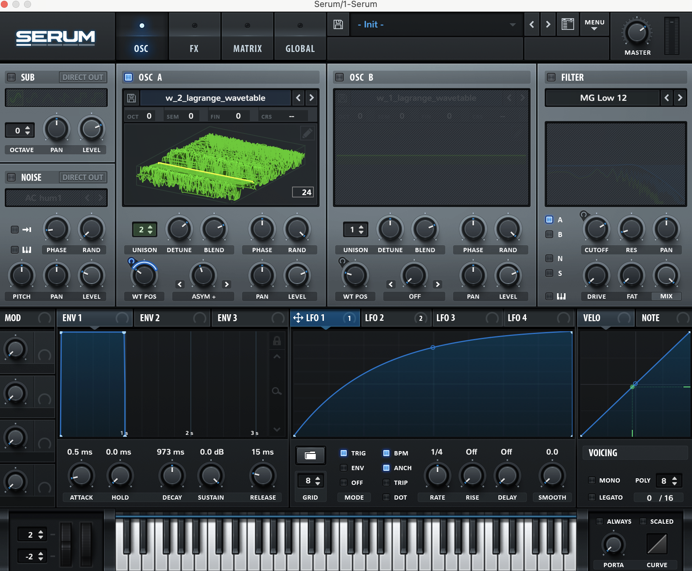

## BANGER - Low Orbit Sonic Cannon
### Create wavetables from your zero knowledge proofs - experience the sounds of privacy

### The Idea
Zero knowledge proof systems convert your programs into some kind of circuit representation, the role of the prover is to turn these circuits into claims about polynomials that can be efficiently checked by the verifier.

## Polynomials are just signals!

This means that we can turn these signals into sounds. That is exactly what this toolkit does.

## The Method
This repository contains a version of noir and barretenberg that will output the witness and selector polynomials of your proofs.

The a python script that will generate wave tables form the polynomials.
It
1. Read the witness files from the artifacts folder.
2. Smooth their evaluations to be within the audible evaluation domain.
3. Perform an FFT on the evaluations to get the frequency-domain signal.
4. Perform an inverse FFT on the positive frequencies to get the time-domain signal.
5. Normalize the inverse FFT result to fit within the range of -32768 to 32767. (16-bit signed integer for the .wav format)
6. Construct a wavetable over the normalized signal.

The wavetables are saved as .wav files which can be dragged into your wavetable synthesizer of choice. (e.g. Serum, Vital, etc.)

### Example
Take the following noir program that performs a sha256 hash function then a secp256k1 signature verification.
```rust
use dep::std;

fn main(
    message: [u8; 38],
    hashed_message: [u8; 32],
    pub_key_x: [u8; 32],
    pub_key_y: [u8; 32],
    signature: [u8; 64]
) {
    // Hash the message, since secp256k1 expects a hashed_message
    let expected = std::hash::sha256(message);
    assert(hashed_message == expected);

    let valid_signature = std::ecdsa_secp256k1::verify_signature(pub_key_x, pub_key_y, signature, hashed_message);
    assert(valid_signature);
}
```
( Make sure you are using the versions of nargo and bb compiled via the ./bootstrap.sh script!)
Run 
```
# 1. Compile the noir program
nargo compile

# 2. Generate the witness mapping (Prover.toml requires valid values)
nargo execute witness

# 3. Run our modified barretenberg binary to generate your proof and witness polynomials
$path_to_bb_binary prove -o proof  
```

This will generate the following files
```
    "w_1_lagrange","w_2_lagrange", "w_3_lagrange", "w_4_lagrange",
    "q_1_lagrange",  "q_2_lagrange", "q_3_lagrange", "q_4_lagrange", "q_c_lagrange", 
    "q_aux_lagrange", "q_c_lagrange",  "q_aux_lagrange", "q_arith_lagrange", "q_sort_lagrange", "q_elliptic_lagrange"
```
That are encodings of the proof polynomials

We then run the cannon script to create these polynomials converted into sound!
```
python3 witness_to_sonic_cannon/cannon.py
```

This will output a series of wav files.

We can then drag and drop these wav files into your wavetable synth.





There you have it - now we can hear our proofs